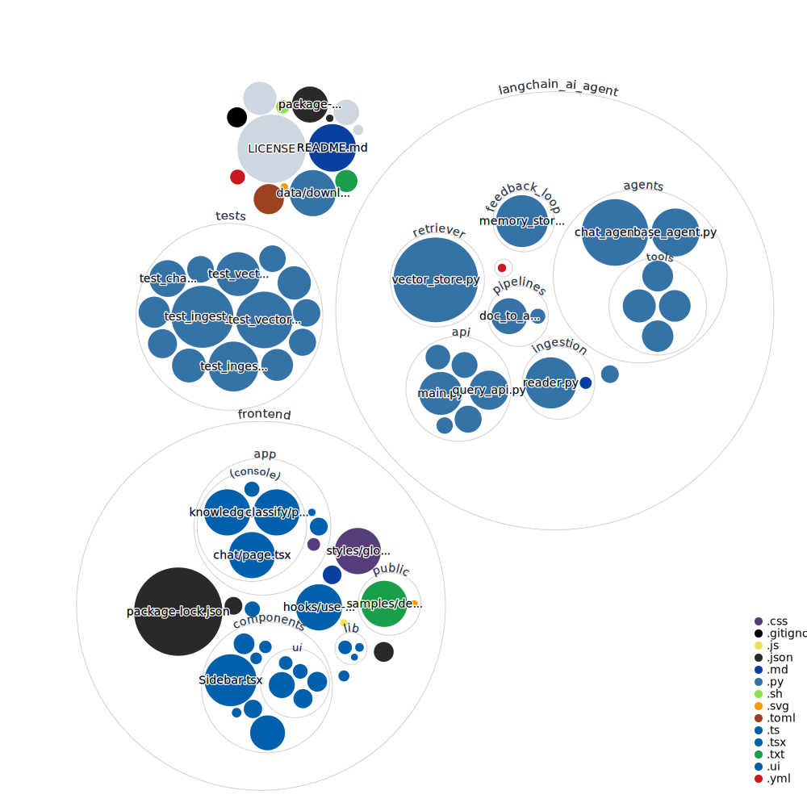

# ai-agent-langchain-rag

一个基于 LangChain、FastAPI 和 Next.js 的智能客服与知识库演示项目。

当前仓库更贴近“智能客服控制台”而不是通用 AI 助手模板，核心能力包括：

- 知识库文档上传、切分、向量化与检索
- 面向知识库的多轮问答
- 面向文档内容的智能分类与工具路由
- 简单的知识库管理界面



## 当前功能

### 1. 智能客服问答

前端首页会直接跳转到 `/chat`，用于发起知识库问答。

- 输入问题后调用后端 `/api/query`
- 后端基于 `faiss_index/<namespace>` 检索知识库
- 支持 `thread_id`，保留会话上下文
- 返回回答内容与来源列表

### 2. 知识库管理

`/knowledge` 页面用于维护知识库文档。

- 上传文档到默认知识库
- 查看已入库文档列表
- 删除指定文档
- 重新构建默认知识库索引

### 3. 文档分类 Agent

项目保留了 `/classify` 页面，但当前没有在侧边栏里直接暴露。

分类 Agent 会先将文本分为以下 4 类，再路由到对应工具：

- `meeting_note`：会议纪要总结
- `contract`：合同风险分析
- `support_ticket`：客服工单分诊
- `knowledge_base`：生成知识库问答对

## 页面说明

当前前端实际可见的主导航页面只有两个：

- `/chat`：智能客服问答
- `/knowledge`：知识库管理

另外还有一个保留页面：

- `/classify`：文档分类与结构化处理

## 技术栈

- 后端：FastAPI
- 前端：Next.js 14、React 18、Tailwind CSS
- Agent 编排：LangChain、LangGraph
- 向量检索：FAISS
- 文档处理：Unstructured、pdfminer、python-docx
- 模型接入：DeepSeek OpenAI-compatible API
- 向量化：Sentence Transformers

## 快速启动

### 1. 配置环境变量

先复制示例配置文件：

```bash
cp .env.example .env
```

PowerShell:

```powershell
Copy-Item .env.example .env
```

然后填写你自己的配置：

```bash
DEEPSEEK_API_KEY=your_deepseek_api_key
DEEPSEEK_MODEL=deepseek-chat
DEEPSEEK_BASE_URL=https://api.deepseek.com/v1
```

### 2. 启动后端

请在仓库根目录执行：

```bash
uvicorn langchain_ai_agent.api.main:app --reload --host 0.0.0.0 --port 8000
```

如果你使用 `Makefile`：

```bash
make api
```

### 3. 启动前端

```bash
cd frontend
npm install
npm run dev
```

默认访问地址：

- 前端：http://localhost:3000
- 后端：http://localhost:8000
- FastAPI 文档：http://localhost:8000/docs

## 环境变量说明

- `DEEPSEEK_API_KEY`：DeepSeek API Key
- `DEEPSEEK_MODEL`：使用的模型名，默认 `deepseek-chat`
- `DEEPSEEK_BASE_URL`：DeepSeek OpenAI-compatible 接口地址
- `NEXT_PUBLIC_API_BASE_URL`：前端请求后端的基础地址，默认 `http://localhost:8000`

## 主要接口

### Agent 与上传

- `POST /upload-docs`：上传文件并提取文本，用于分类页
- `POST /run-agent`：执行文档分类与工具路由
- `POST /run-pipeline`：对指定目录执行文档流水线

### 知识库

- `POST /api/ingest`：上传文件并写入向量索引
- `GET /api/kb/documents`：获取知识库文档列表
- `DELETE /api/kb/documents/{filename}`：删除知识库文档
- `POST /api/kb/rebuild`：重建默认知识库

### 问答

- `GET /api/query`：知识库问答
- `GET /api/state`：查看会话状态
- `POST /api/reset`：重置会话状态

## 项目结构

```text
.
├─ langchain_ai_agent/        # 后端应用、agent、API、检索与文档处理
├─ frontend/                  # Next.js 前端控制台
├─ tests/                     # 后端测试
├─ data/                      # 示例脚本与本地数据目录
├─ faiss_index/               # 本地向量索引（默认不提交）
├─ memory_index/              # 本地记忆索引（默认不提交）
└─ tmp_uploads/               # 临时上传目录（默认不提交）
```

## 当前说明与限制

- README 以当前仓库实际实现为准，不再沿用早期“通用 AI 助手”模板描述。
- `/classify` 页面仍然存在，但当前默认导航只展示 `/chat` 和 `/knowledge`。
- 本地 `.env`、向量索引、缓存和测试数据目录默认不会提交到 Git。
- 当前仓库更适合作为演示项目或二次开发基础，而不是直接上线的生产系统。
